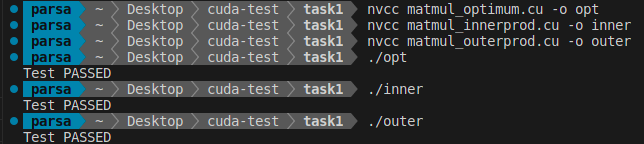
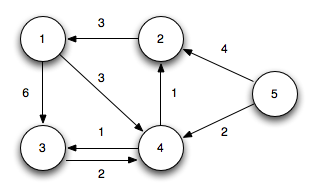
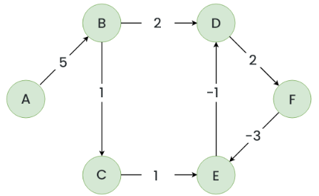

# CUDA tasks

## Task 1: Implement matrix multiplication in two different approaches

In this task, we aim to calculate the product of matrices A and B with the following dimensions:

- **A**: MxN
- **B**: NxP
- **C**: MxP

We use 3 different approaches where the first approach is more efficient but has more limitations. The second approach is less efficient but has no limitations. The third approach is more efficient and has more limitations.

### 1) Optimum approach

In this approach, we use one thread for each multiplication, which means we have MxP blocks per grid and N threads per block. After calculating the products, we add them using **atomic addition**.

#### limitations

- N < 1024
- M*P < Maximum number of blocks per grid (depending on the GPU model)

### 2) Inner product approach

In this approach, we have one thread for each output element in C, which means we have MxP threads in total. In each thread, we calculate the dot product using a for loop. We use local memory in each thread for partial sums to avoid access to global memory.

#### limitations

- M*P < Maximum number of threads in total

### 3) Outer product approach

In this approach, we have one block for each outer product, which means we have N blocks in total. In each block, there are MxP threads to calculate the outer product in parallel. We use **shared memory** to reduce the number of accesses to global memory. At the end, we sum up the outer products using atomic addition.

#### limitations

- M*P < 1024
- N < Maximum number of blocks per grid
  
### Notes

- Some useful functions that were used several times are written in `helpers.cu`. This file is then included in the main files.
- Some lines of code are embraced between `//! for debugging [begin]` and `//! for debugging [end]`. These lines can be uncommented for debugging purposes.

### Run and Test

We use `nvcc` to compile our CUDA programs. In order to test the functionality of our codes, we use matrices A(3x1000) and B(1000x4) so that the output C is 3x4.



### Profiling

We can use `nvprof` to profile the process of running. The results on my own GPU (NVIDIA GeForce MX450) is as follows:

#### 1) Optimum approach

```txt
==38049== NVPROF is profiling process 38049, command: ./opt
Test PASSED
==38049== Profiling application: ./opt
==38049== Profiling result:
            Type  Time(%)      Time     Calls       Avg       Min       Max  Name
 GPU activities:   84.58%  21.408us         1  21.408us  21.408us  21.408us  matmul_optimum(float*, float*, float*, int, int, int)
                   10.49%  2.6560us         3     885ns     320ns  1.1840us  [CUDA memcpy HtoD]
                    4.93%  1.2480us         1  1.2480us  1.2480us  1.2480us  [CUDA memcpy DtoH]
      API calls:   99.25%  39.574ms         3  13.191ms  2.4580us  39.568ms  cudaMalloc
                    0.28%  111.33us         1  111.33us  111.33us  111.33us  cudaLaunchKernel
                    0.27%  105.94us       114     929ns      90ns  40.985us  cuDeviceGetAttribute
                    0.14%  55.164us         4  13.791us  6.4500us  29.215us  cudaMemcpy
                    0.04%  15.739us         1  15.739us  15.739us  15.739us  cuDeviceGetName
                    0.01%  5.1760us         1  5.1760us  5.1760us  5.1760us  cuDeviceGetPCIBusId
                    0.01%  2.9650us         1  2.9650us  2.9650us  2.9650us  cuDeviceTotalMem
                    0.01%  2.0610us         3     687ns     144ns  1.7580us  cuDeviceGetCount
                    0.00%     411ns         2     205ns      86ns     325ns  cuDeviceGet
                    0.00%     178ns         1     178ns     178ns     178ns  cuModuleGetLoadingMode
                    0.00%     150ns         1     150ns     150ns     150ns  cuDeviceGetUuid
```

#### 2) Inner product approach

```text
==38110== NVPROF is profiling process 38110, command: ./inner
Test PASSED
==38110== Profiling application: ./inner
==38110== Profiling result:
            Type  Time(%)      Time     Calls       Avg       Min       Max  Name
 GPU activities:   99.19%  481.32us         1  481.32us  481.32us  481.32us  matmul_innerprod(float*, float*, float*, int, int, int)
                    0.55%  2.6880us         3     896ns     352ns  1.1840us  [CUDA memcpy HtoD]
                    0.26%  1.2490us         1  1.2490us  1.2490us  1.2490us  [CUDA memcpy DtoH]
      API calls:   98.18%  52.997ms         3  17.666ms  2.4380us  52.990ms  cudaMalloc
                    0.95%  514.03us         4  128.51us  5.7650us  488.17us  cudaMemcpy
                    0.54%  293.97us       114  2.5780us     303ns  110.72us  cuDeviceGetAttribute
                    0.22%  117.06us         1  117.06us  117.06us  117.06us  cudaLaunchKernel
                    0.07%  37.030us         1  37.030us  37.030us  37.030us  cuDeviceGetName
                    0.02%  9.6450us         1  9.6450us  9.6450us  9.6450us  cuDeviceTotalMem
                    0.01%  5.0940us         3  1.6980us     429ns  4.1630us  cuDeviceGetCount
                    0.01%  4.7040us         1  4.7040us  4.7040us  4.7040us  cuDeviceGetPCIBusId
                    0.00%  1.4980us         2     749ns     337ns  1.1610us  cuDeviceGet
                    0.00%     786ns         1     786ns     786ns     786ns  cuModuleGetLoadingMode
                    0.00%     487ns         1     487ns     487ns     487ns  cuDeviceGetUuid
```

#### 3) Outer product approach

```text
==38167== NVPROF is profiling process 38167, command: ./outer
Test PASSED
==38167== Profiling application: ./outer
==38167== Profiling result:
            Type  Time(%)      Time     Calls       Avg       Min       Max  Name
 GPU activities:   64.35%  7.3920us         1  7.3920us  7.3920us  7.3920us  matmul_outerprod(float*, float*, float*)
                   23.68%  2.7200us         3     906ns     352ns  1.2160us  [CUDA memcpy HtoD]
                   11.98%  1.3760us         1  1.3760us  1.3760us  1.3760us  [CUDA memcpy DtoH]
      API calls:   98.82%  41.208ms         3  13.736ms  2.5700us  41.201ms  cudaMalloc
                    0.69%  286.43us       114  2.5120us     310ns  106.58us  cuDeviceGetAttribute
                    0.26%  107.06us         1  107.06us  107.06us  107.06us  cudaLaunchKernel
                    0.09%  39.160us         1  39.160us  39.160us  39.160us  cuDeviceGetName
                    0.09%  38.401us         4  9.6000us  6.2060us  13.192us  cudaMemcpy
                    0.02%  9.1280us         1  9.1280us  9.1280us  9.1280us  cuDeviceTotalMem
                    0.01%  5.7810us         3  1.9270us     474ns  4.8000us  cuDeviceGetCount
                    0.01%  3.9580us         1  3.9580us  3.9580us  3.9580us  cuDeviceGetPCIBusId
                    0.00%  1.6180us         2     809ns     334ns  1.2840us  cuDeviceGet
                    0.00%     808ns         1     808ns     808ns     808ns  cuModuleGetLoadingMode
                    0.00%     489ns         1     489ns     489ns     489ns  cuDeviceGetUuid
```

## Task 2: Parallel Bellman-Ford Algorithm

In this task, we aim to implement the Bellman-Ford algorithm (which is a single source shortest path(SSSP) algorithm to find the shortest path from a source vertex to every other vertex) in CUDA using a parallel approach.

**How it works:** In this algorithm, assuming that we have a graph $G(V, E)$ we should relax all edges $|V| - 1$ times. If the graph has no negative cycle, in this stage we have the correct answer. To check for a negative cycle, we do the relaxation one more time. If any distance is changed, then there is a negative cycle.

### Main Idea

The main idea to parallelize this algorithm is to relax all the edges in parallel in each iteration. In order to achieve this, we assign each thread to one edge in the graph. At the end of each iteration, we should synchronize all the threads.

#### First Challenge

I first tried using `__syncthreads()` at the end of each iteration and call the kernel just once. But it turns out that `__syncthreads()` just synchronizes threads in a block, not all the threads in the grid.

**Solution:** To solve this challenge, we have to control the sequential part of the algorithm in the host. So we call the kernel function $|V| - 1$ times in a loop in the host. This will force all threads to be synchronized after each iteration.

#### Second Challenge

I used the following `struct` to store the graph:

```c
typedef struct Edge {
    int src, dst, weight;
} Edge;

typedef struct Graph {
    int V, E;
    Edge* edges;
} Graph;
```

This just works fine until the step in which we want to copy the graph from the host to the device. If we just copy the `Graph` struct, the array in it (`edges`) doesn't get copied.

**Solution:** To copy a `Graph` struct, we need to copy the `edges` array independently. In order to fix this problem, I used [this answer in StackOverflow](https://stackoverflow.com/questions/15431365/cudamemcpy-segmentation-fault/15435592#15435592), in which we use a temporary pointer and use it to allocate a space for the `edges` array in the device. Then we copy its *pointer value* from the host into `&(graph_dev->edge)` in the device. At the end we can copy the whole array from the host (`graph->edges`) to the device (temporary pointer).

#### Improvement

We don't always need to iterate $|V| - 1$ times. We define a variable `bool changed` that shows if any vertex's distance has been changed after each iteration. If there is no change in any of the graph's vertices, we can terminate the algorithm (and go for the last check for negative cycle).

### Data

In the `data` directory, there are three files:

1. `USA-road-d.CAL.gr`: a huge graph with only positive edges.
2. `small graph.gr`: a simple graph to test the program functionallity:
   
3. `neg cycle.gr`: a simple graph to test the program ability to detect negative cycles.
   

### Notes

- The input files conatain one-based numbering for vertices (the source vertex is $1$), but we use zero-based numbering. So in the lines 110 and 111, we first decrement the inputs and then we store them.
- There are some auxilary functions to print the graph and the distance array, called `print_graph` and `print_dist` respectively. These functions has a shorter format called `print_graph_brief` and `print_dist_brief` respectively. These two functions only prints the first and last 5 elements.
- Some lines are commented by `//! for debugging` which can be uncommented for debugging purposes.
